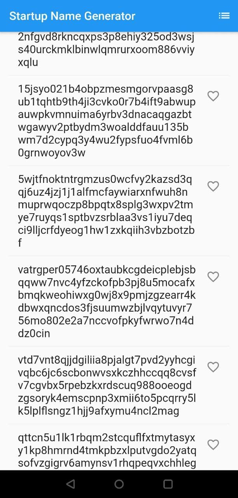
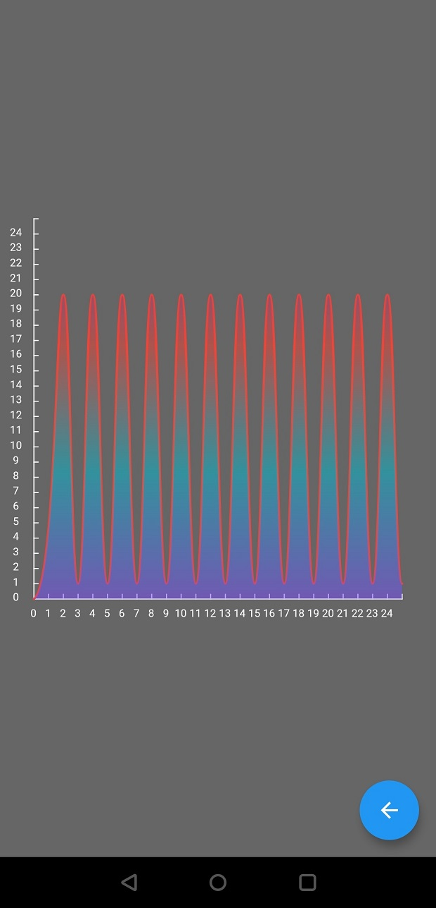

# Aplicación de demostración del controlador de widget de Gráfico y Lista para la plataforma Flutter Android

Esta es una aplicación de demostración simple que instruye a los programadores sobre cómo usar los componentes básicos de Flutter. Incluye una vista de lista de cadenas con función de recopilación y también un gráfico de curvas con eje XY y número. Estas dos páginas se pueden cambiar libremente utilizando "Navigator".

## Comenzando

Este proyecto es un punto de partida para una aplicación Flutter. Aquí están las instrucciones.

- Instala el plugin de Flutter en Android Studio.
- Crea un nuevo proyecto de Flutter, elige la ruta de instalación del SDK y haz clic en el botón de instalación. Luego completa el asistente con los valores predeterminados.
- Copia el contenido del archivo de código fuente 'lib/main.dart' en tu proyecto.
- Haz clic en la opción de actualización de pub en el menú "Herramientas/Flutter".
- Haz clic en "Compilar/Flutter/Compilar APK".
- Instala la aplicación y ¡diviértete!

### Capturas de Pantalla

